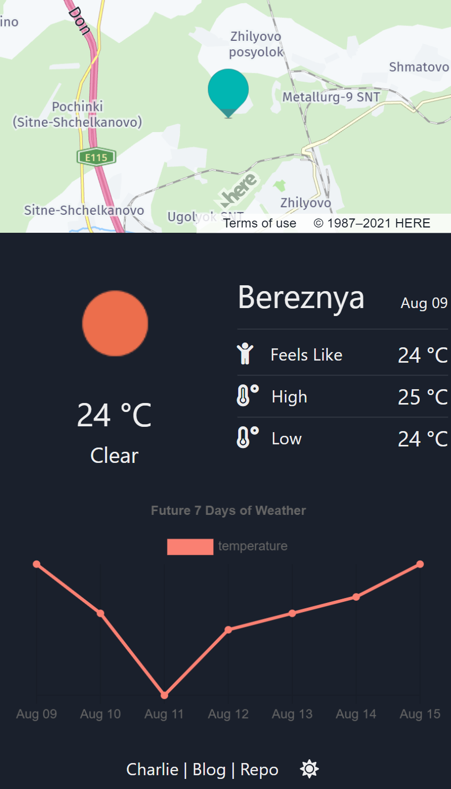
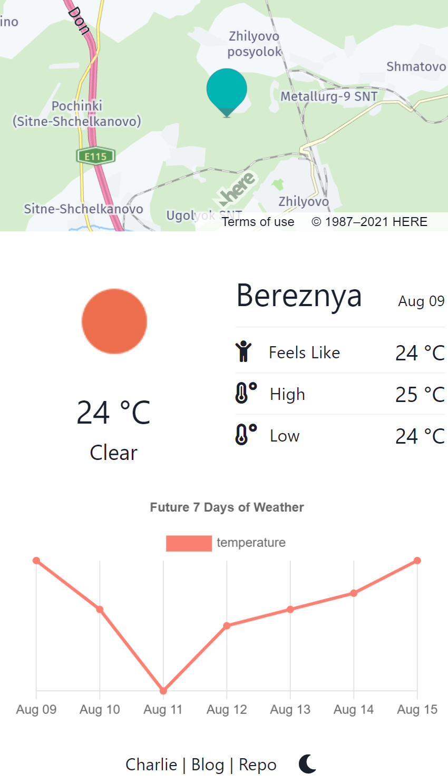
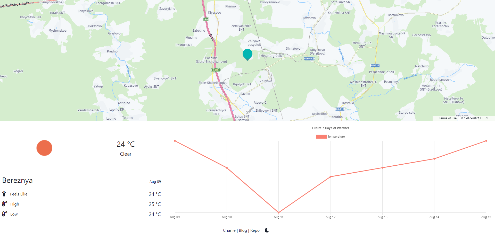

# Weather Map App

## 天氣 App

[LIVE DEMO](https://wlcharlie.github.io/weather-map-app/)

_`若Loading過久，代表API太累了，請稍後再試`_

## 功能

- 查看特定位置天氣
- 查看特定位置未來一周天氣 (Chart)
- 查看圖表上的溫度轉換 (C/F/K)
- 點擊地圖重新定位位置 (查看別處的天氣)
- 縮放、移動地圖
- 切換深夜配色 (最下方的太陽/月亮按鈕)

## 工具及開發

- React
- Moment.js _(for time)_
- Chart.js _(for chart)_
- Axios _(for APIs)_
- Chakra-ui

### APIs

- Open Weather Map _(via Rapid API)_
- Here Map

## 預覽

> Mobile

> Web

